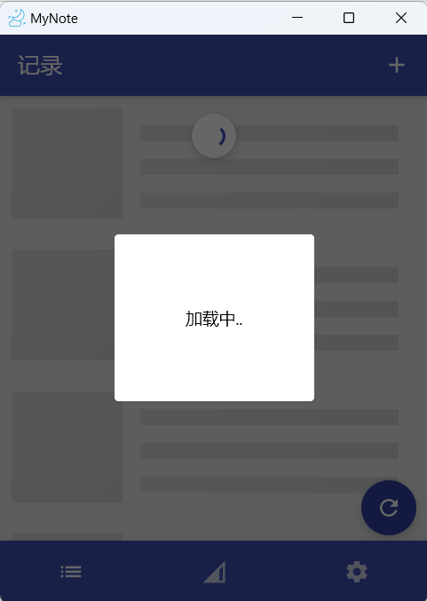

# MyNote
 kotlin muliti-platform demo 
使用到的库列表:  

[voyager](https://github.com/adrielcafe/voyager)   
[napier](https://github.com/AAkira/Napier)   
[coroutines](https://github.com/Kotlin/kotlinx.coroutines)   
[ktor](https://github.com/ktorio/ktor)   
[serialization](https://github.com/Kotlin/kotlinx.serialization)   
[kotlinx-datetime](https://github.com/Kotlin/kotlinx-datetime)   
[koin](https://github.com/InsertKoinIO/koin)   
[multiplatform-settings](https://github.com/russhwolf/multiplatform-settings)   
[sqldelight](https://github.com/cashapp/sqldelight/)   
[MVI](https://github.com/daniaviladomingo/kmm)   

 |  

|  |   
|  

